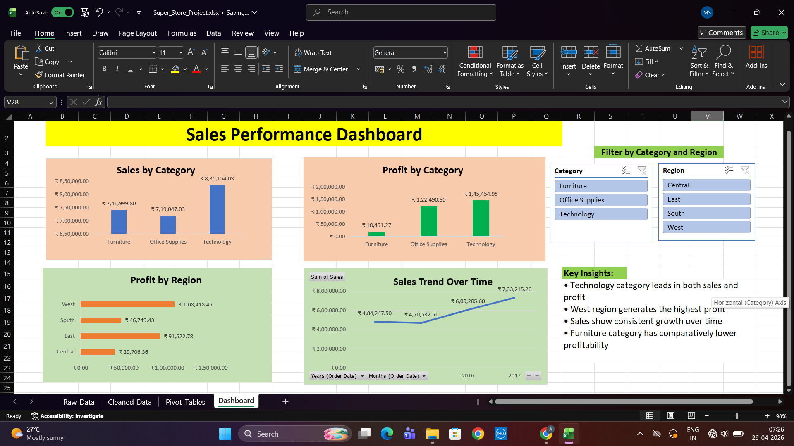

# Superstore Sales Analysis Dashboard

## 📊 Project Overview
This project analyzes Superstore sales data to uncover insights on sales performance, profit trends, and customer segments.

## 🛠 Tools Used
- Excel 
- Pivot Tables
- Charts & Dashboards
- Data Cleaning

## 📌 Key Insights
- Identified top-performing categories and regions
- Analyzed monthly sales and profit trends
- Found low-performing segments for improvement
- Customer and product performance insights

## 🎯 Objective
To support data-driven business decisions by visualizing sales performance and identifying growth opportunities.

## 📁 Dataset
Superstore sales dataset (retail transactional data)
## 📊 Dashboard Preview

